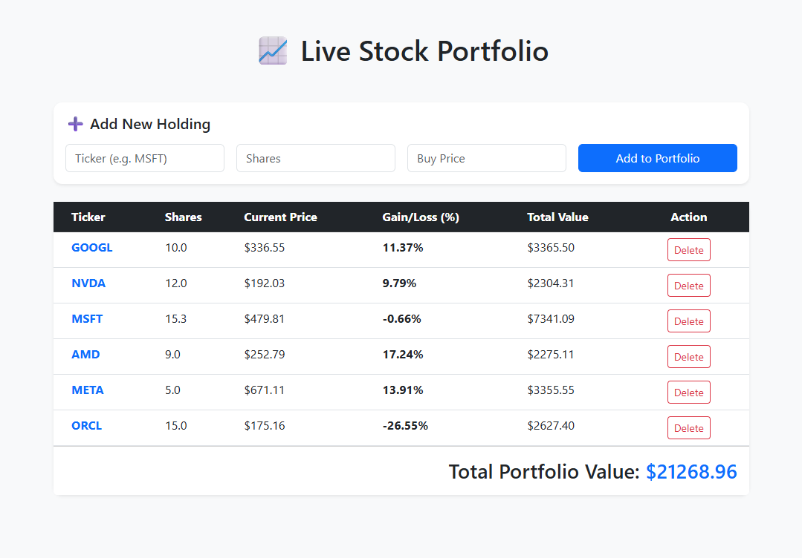

# Full-Stack Stock Portfolio Tracker (Python/Flask)



A real-time web application that allows users to manage a stock portfolio. This project demonstrates the ability to integrate live financial APIs, manage persistent data with SQL, and build a responsive user interface.

## Features
* **Live Price Integration:** Uses the `yfinance` API to fetch real-time market prices.
* **Full CRUD Functionality:** Users can Create, Read, and Delete stock holdings via a web dashboard.
* **Persistent Storage:** Utilizes SQLite to store portfolio data locally.
* **Security-First Logic:** Implements SQL parameterization to prevent SQL Injection attacks.

## Tech Stack
* **Backend:** Python 3.14.0, Flask
* **Database:** SQLite3
* **Data Source:** Yahoo Finance API (`yfinance`)
* **Frontend:** HTML5, Jinja2, Bootstrap 5

## System Architecture
The project follows a **Separation of Concerns** design pattern:
1.  `database.py`: Handles all SQL transactions and schema initialization.
2.  `engine.py`: Contains the logic for mathematical calculations and API calls.
3.  `app.py`: The controller that routes traffic between the database and the UI.
4.  `templates/`: Contains the Jinja2 templates for the frontend.


## Security Implementation
One key focus of this project was protecting the database. I avoided using Python f-strings for SQL queries, instead opting for **? placeholders** (parameterized queries). This ensures that user input is treated as data, not executable code, effectively preventing **SQL Injection**.

## How to Run
1.  **Clone the repo:**
    ```bash
    git clone [https://github.com/YOUR_USERNAME/PortfolioTracker.git](https://github.com/YOUR_USERNAME/PortfolioTracker.git)
    cd PortfolioTracker
    ```
2.  **Install dependencies:**
    ```bash
    pip install -r requirements.txt
    ```
3.  **Initialize the database:**
    ```bash
    python database.py
    ```
4.  **Start the server:**
    ```bash
    python app.py
    ```
5.  View the app at `http://127.0.0.1:5000`